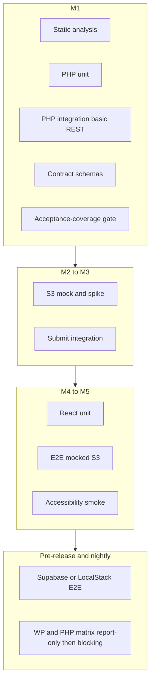

# Testing Strategy: RFQ Intake (V1)

**Status:** Approved for V1  
**Runtime baseline:** PHP 8.3+, PHPUnit 11, WordPress 6.4+  
**Source chain:** [PRD §7](PRD.md) (acceptance IDs) → this registry → [IMPLEMENTATION](IMPLEMENTATION.md) milestones  
**Scope:** WordPress plugin repo (`rfq-intake` + `frontend/`). ERP criteria are marked **ERP repo**.

See also: [ADD §23](ADD.md) (why), [PRD §5.4](PRD.md) (requirement), [IMPLEMENTATION §8](IMPLEMENTATION.md) (when tests land).

---

## 1. Test pyramid

Layers accumulate by implementation milestone. The full PR-equivalent suite runs only at **pre-release**; main/nightly adds Supabase-compatible or LocalStack E2E.



---

## 2. Layer reference

| Layer | Tooling | Typical activation |
|-------|---------|-------------------|
| Static analysis | PHPCS, PHPStan, ESLint, `tsc --noEmit` | M1 CI |
| PHP unit | PHPUnit 11 + Brain Monkey | M1 |
| PHP integration | wp-env `tests-cli` | M1 (basic REST); expanded M2–M3 |
| Contract | JSON Schema vs PRD §3.1 | M1 (initial); grows per endpoint |
| React unit | Vitest + React Testing Library + MSW | M4–M5 |
| E2E mocked S3 | Playwright + `@wordpress/e2e-test-utils-playwright` + S3 mock | M4–M5 |
| E2E Supabase-compatible | Playwright + staging/dev Supabase bucket **or** LocalStack (SigV4, path-style) | Pre-release; main/nightly report-only → blocking |
| Accessibility smoke | Playwright + `@axe-core/playwright` (or equivalent) | M5 / pre-release |

---

## 3. Acceptance-criterion registry

### Gate policy

Each current-scope plugin criterion has a **stable ID**. Before V1 release, every `AC-WP-*` ID must map to ≥1 automated test in this repo.

A planned build artifact `scripts/check-acceptance-coverage.php` (introduced at **M1**) parses this registry and **fails if an in-scope ID has no mapped test** once that milestone's CI tier is active. The `Mapped test` column is filled during implementation.

**Tagging:** Tests reference IDs via docblock or annotation, e.g. `@covers AC-WP-003`. Do not use an arbitrary test-count gate.

### PRD §7 criteria

| ID | Source | Criterion | Owner | Milestone | Test type(s) | Mapped test |
|----|--------|-----------|-------|-----------|--------------|-------------|
| AC-ERP-001 | PRD §7 | Submission locatable in ERP within one poll cycle (≤5 min) | ERP repo | — | ERP integration/E2E | — |
| AC-WP-001 | PRD §7 | Re-submit same session → same receipt number, no duplicate quote | Plugin | M3 | PHP unit + integration | — |
| AC-WP-002 | PRD §7 | WP unreachable on page load → Airtable within 3s | Plugin | M4–M5 | Vitest + E2E | — |
| AC-WP-003 | PRD §7 | S3 upload fail → per-file error + retry, form data preserved | Plugin | M4–M5 | Vitest + E2E | — |
| AC-WP-004 | PRD §7 | Submit fail after uploads → retry without re-upload | Plugin | M4–M5 | Vitest + E2E | — |
| AC-WP-005 | PRD §7 | Receipt in S3 + WP DB not lost when ERP/webhook down | Plugin | M3 | PHP integration | — |
| AC-WP-006 | PRD §7 | 11th session/hour/IP → HTTP 429 | Plugin | M1 | PHP unit + integration | — |
| AC-WP-007 | PRD §7 | Form source is TypeScript only | Plugin | M4 | ESLint + `tsc` | — |
| AC-WP-008 | PRD §7 | UI styled with Tailwind only | Plugin | M4 | Lint / convention check | — |

### IMPLEMENTATION §7 plugin checkboxes

| ID | Criterion | Owner | Milestone | Test type(s) | Mapped test |
|----|-----------|-------|-----------|--------------|-------------|
| AC-WP-009 | `[rfq_form]` renders form; assets only on shortcode pages | Plugin | M5 | E2E / integration | — |
| AC-WP-010 | Admin configures S3, emails, Airtable, webhook without redeploy | Plugin | M2–M3 | Integration | — |
| AC-WP-011 | Secrets write-only, encrypted at rest | Plugin | M2 | Unit + integration | — |
| AC-WP-012 | `GET /health` 200 only when S3 reachable | Plugin | M1 | Integration | — |
| AC-WP-013 | Full happy path through receipt | Plugin | M5 | E2E | — |
| AC-WP-014 | Success screen SVG, copy, muted receipt ref | Plugin | M5 | E2E / Vitest | — |
| AC-WP-015 | Page refresh → new session; prior warm lead retained | Plugin | M5 | E2E + integration | — |
| AC-WP-016 | >20 parts blocked in UI and on submit | Plugin | M3–M5 | Unit + Vitest + E2E | — |
| AC-WP-017 | Invalid manifest → 422 field errors | Plugin | M3 | PHP unit + integration | — |
| AC-WP-018 | Missing manifest file keys at submit → explicit error | Plugin | M3 | PHP integration | — |
| AC-WP-019 | Webhook POST on submit when configured; submit succeeds if webhook down | Plugin | M3 | PHP integration | — |

### Additional V1 coverage

| ID | Topic | Owner | Milestone | Test type(s) | Mapped test |
|----|-------|-------|-----------|--------------|-------------|
| AC-WP-020 | Secret settings: encrypt at rest; blank save preserves; rotation effective; never in localized config, HTML, REST, logs | Plugin | M2 | Unit + integration | — |
| AC-WP-021 | Admin validation: missing S3 settings, invalid endpoint, blank webhook OK, bad webhook secret does not break submit | Plugin | M2–M3 | Integration | — |
| AC-WP-022 | Receipt sequence: concurrent submits → unique receipt numbers | Plugin | M3 | PHP unit + integration | — |
| AC-WP-023 | Activation/migration idempotency: repeated `dbDelta`/activate safe | Plugin | M1 | Integration | — |
| AC-WP-024 | S3/CORS: browser PUT + preflight against Supabase-compatible endpoint (see §5) | Plugin | M2 spike; M5 E2E | Spike + E2E | — |
| AC-WP-025 | Orphaned manifest alert: manifest without receipt >15 min detected | Plugin | M3–M4 | Unit + cron/integration | — |
| AC-WP-026 | 30-day unreceipted intake prefix cleanup candidate detection | Plugin | M3 | Unit / cron logic | — |
| AC-WP-027 | Accessibility smoke: labels, errors, retry buttons, keyboard nav across steps | Plugin | M5 | Playwright + axe | — |

### ERP IMPLEMENTATION §7 checkboxes

| ID | Criterion | Owner | Mapped test |
|----|-----------|-------|-------------|
| AC-ERP-002 | Webhook verifies HMAC signature | ERP repo | — |
| AC-ERP-003 | Poll worker imports receipt within 5 minutes when webhook skipped | ERP repo | — |
| AC-ERP-004 | Duplicate import attempts create one quote only | ERP repo | — |
| AC-ERP-005 | Import copies only manifest-referenced keys to quote storage | ERP repo | — |
| AC-ERP-006 | Import deletes `intake/{session_id}/` prefix after success | ERP repo | — |
| AC-ERP-007 | Import skips sessions with manifest but no receipt | ERP repo | — |

---

## 4. Progressive CI enforcement

CI workflows are **build artifacts** (first `.github/workflows/test.yml` at **M1**). Gates **accumulate** — later milestones add jobs; earlier jobs stay required.

| Milestone | CI jobs that must pass | Acceptance IDs that must be mapped |
|-----------|------------------------|-------------------------------------|
| **M1** | `lint` (PHPCS, PHPStan; ESLint/tsc when frontend scaffold exists), `php-unit`, `php-integration` (POST /sessions, GET /health, plugin activate/schema), `contract` (session + health schemas), `acceptance-coverage` (M1 scope only) | AC-WP-006, AC-WP-012, AC-WP-023 |
| **M2** | M1 + upload-url integration, S3 key/presign unit tests, S3 mock adapter tests, **S3 validation spike** (§5) | + AC-WP-010, AC-WP-011, AC-WP-020, AC-WP-021, AC-WP-024 (spike) |
| **M3** | M2 + submit integration, receipt durability, idempotency, missing-file failures, webhook non-blocking, receipt concurrency | + AC-WP-001, AC-WP-005, AC-WP-016–019, AC-WP-022, AC-WP-025, AC-WP-026 |
| **M4–M5** | M3 + `frontend-unit`, `e2e-mocked`, a11y smoke job | + AC-WP-002–004, AC-WP-007–009, AC-WP-013–015, AC-WP-027 |
| **Pre-release** | Full PR-equivalent suite; Supabase-compatible or LocalStack E2E smoke; **all `AC-WP-*` IDs mapped** | All AC-WP-* |
| **Main / nightly** | `e2e-supabase` or `e2e-localstack`; WP/PHP matrix (PHP 8.3 + current WP primary) | Report-only initially → blocking once stable |

### Coverage floors

Enforced when the corresponding job exists; ramp with milestones.

| Area | Floor | Active from |
|------|-------|-------------|
| `rfq-intake/includes/` business logic | 80% line | M3 |
| `frontend/src/lib/` + hooks | 80% | M5 |
| `frontend/src/` components | 60% | M5 |
| Acceptance registry | 100% in-scope IDs mapped | Pre-release |

**Deferred / advisory:** Codecov diff coverage (optional PR comment). See [FUTURE.md](FUTURE.md) for required enforcement.

---

## 5. S3 / Supabase direct-upload validation

### Known uncertainty

PRD §3.3.2 describes policy-style conditions (`content-length-range`, content-type). AWS **pre-signed PUT** URLs do not support POST-style policy documents. Enforceability of size and content-type on PUT varies by S3-compatible provider (including Supabase). **Do not assume POST policy semantics apply to presigned PUT without validation.**

### Required coverage

| Topic | Test approach | Maps to |
|-------|---------------|---------|
| Pre-signed PUT against Supabase-compatible endpoint | M2 **validation spike** (manual + automated smoke in staging/dev bucket); document findings in §5.1 appendix | AC-WP-024 |
| Browser CORS + OPTIONS preflight for direct PUT | Playwright or curl preflight in spike; repeat in pre-release E2E against Supabase or LocalStack with matching CORS | AC-WP-024 |
| Exact-key enforcement | Unit: presign bound to single key; integration: PUT to wrong key fails; client cannot substitute key | AC-WP-018 |
| Content-Type: part (`application/octet-stream`) vs drawing (pdf/png/jpeg) | Unit + spike: wrong Content-Type rejected or fails at PUT; server validates at submit | M2–M3 |
| File size limits | Where PUT cannot enforce max size: client UX limits + submit-time **HeadObject** size check (if available) + manifest validation; spike confirms which layers work on Supabase | M2 spike, M3 integration |
| Server-side submit validation | HeadObject existence (+ size/metadata where API allows); manifest validation rejects bad keys | AC-WP-017, AC-WP-018 |
| Path-style endpoint | If Supabase requires `use_path_style_endpoint`, spike confirms presign + browser PUT work | M2 spike |

Mock S3 in PR CI simulates expected behavior. Supabase or LocalStack E2E on main/nightly confirms real compatibility.

### 5.1 S3 PUT validation report (M2 spike deliverable)

During **M2** build, run a validation spike against the Supabase dev/staging bucket and record results here:

| Check | Method | Pass / fail | Notes |
|-------|--------|-------------|-------|
| Presigned PUT accepts part file | curl or Playwright | _TBD_ | |
| Presigned PUT accepts drawing MIME types | curl or Playwright | _TBD_ | |
| Wrong Content-Type rejected or fails | curl | _TBD_ | |
| Oversized file blocked at PUT or caught at submit | curl + submit | _TBD_ | |
| Browser OPTIONS preflight succeeds | curl -X OPTIONS | _TBD_ | |
| Browser PUT from form origin succeeds | Playwright | _TBD_ | |
| Path-style endpoint (if required) | curl + Playwright | _TBD_ | |
| Exact-key binding (wrong key fails) | curl | _TBD_ | |

Update presign implementation assumptions if any check fails.

---

## 6. Security, admin, concurrency, ops, accessibility

### 6.1 Secret settings (AC-WP-020)

- Values encrypted at rest before `wp_options` persistence (not encoding).
- Blank admin save preserves existing secret; non-blank replaces (rotation).
- REST responses, localized script config, HTML source, and logs never contain plaintext or decryptable ciphertext of S3 secret, JWT secret, or webhook secret.

### 6.2 Admin / config validation (AC-WP-021)

- Missing or invalid S3 settings → health fails or endpoints return appropriate errors.
- Blank ERP webhook URL → webhook skipped; submit still succeeds.
- Mismatched webhook secret on ERP side → webhook fails silently from WP perspective; submit still succeeds (AC-WP-019).

### 6.3 Receipt sequence concurrency (AC-WP-022)

- Simultaneous submit requests for different sessions must allocate unique receipt numbers.
- Use DB-level sequence (`rfq_receipt_sequences`) with concurrency test (parallel PHPUnit or integration).

### 6.4 DB activation idempotency (AC-WP-023)

- Running plugin activation / `dbDelta` twice must not corrupt schema or duplicate constraints.

### 6.5 Orphaned manifest alert (AC-WP-025)

- Cron or monitoring logic detects `manifest.json` without `receipt.json` after 15 minutes (PRD §3.4, §5.1).

### 6.6 30-day unreceipted cleanup detection (AC-WP-026)

- Logic identifies intake prefixes older than 30 days with no `receipt.json` as cleanup candidates (PRD §3.3.3).

### 6.7 Accessibility smoke (AC-WP-027)

Not a full WCAG audit. Automated smoke checks:

- Form fields have associated labels.
- Validation errors are perceivable (visible text or `aria-live`).
- Retry buttons are keyboard-focusable and activatable.
- Step navigation works via keyboard.

---

## 7. Planned repository layout

**Created during M1+ build — not part of planning-doc-only passes.**

```
tests/php/unit/
tests/php/integration/
tests/contract/schemas/
tests/e2e/specs/
tests/e2e/fixtures/
tests/e2e/mocks/
.wp-env.json                    # M1
phpunit.xml.dist                # M1
playwright.config.ts            # M4
.github/workflows/test.yml      # M1, grows by milestone
scripts/check-acceptance-coverage.php  # M1
```

**Design requirement:** S3 access behind `S3ClientInterface` so unit tests, mock adapter, Supabase, and LocalStack swap without changing business logic. See [ADD §23](ADD.md).

---

## 8. Tooling

| Area | Choices |
|------|---------|
| PHP | 8.3+, PHPUnit 11, Brain Monkey, wp-env (PHP 8.3 image), PHPCS + WordPress Coding Standards, PHPStan |
| Frontend | Vitest, MSW, React Testing Library, ESLint, TypeScript strict |
| E2E | Playwright, `@wordpress/e2e-test-utils-playwright`, `@axe-core/playwright` |
| CI | GitHub Actions |

---

## 9. Planned local commands

Available once M1+ tooling is scaffolded:

```bash
composer test
composer test:integration
npm run test
npm run test:e2e
npm run test:e2e:localstack   # or test:e2e:supabase
npm run test:acceptance-coverage
```

---

## 10. PHPUnit reference (planned test classes)

Once M1 scaffold exists, target these classes under `tests/php/`:

| Test class | Cases | AC IDs |
|------------|-------|--------|
| `ManifestValidatorTest` | Valid manifest; missing email; custom tolerance without detail; qty 0; 21 parts; past delivery date; invalid postal code | AC-WP-016, AC-WP-017 |
| `PostalCodeTest` | US 5/9 digit; CA format; rejects garbage | AC-WP-017 |
| `PhoneValidatorTest` | 10 digits pass; 9 fail; phone requires country code 1 | AC-WP-017 |
| `ReceiptNumberTest` | Format `RFQ-YYYYMMDD-000001`; daily rollover | AC-WP-022 |
| `JwtServiceTest` | Sign/verify; expiry; session_id claim; wrong session rejected | AC-WP-006 area |
| `S3KeyBuilderTest` | Sanitization; prefix; UUID suffix; rejects client-supplied keys | AC-WP-024 |
| `RateLimiterTest` | Session creation per IP; upload-url per session | AC-WP-006 |
| `SecretsTest` | Encrypt/decrypt; blank save preserves; no leak in REST output | AC-WP-020 |
| `ReceiptConcurrencyTest` | Parallel submits → unique numbers | AC-WP-022 |
| `ActivatorTest` | Double activation idempotent | AC-WP-023 |

---

## 11. Manual staging supplement

**Pre-production smoke only — not a merge gate.** Required before first production deploy.

### Plugin staging

1. Configure admin settings with staging S3 bucket + blank or staging webhook URL.
2. Place `[rfq_form]` on a test page.
3. Complete RFQ with one part + one drawing PDF.
4. Verify objects in S3 under `intake/{session_id}/`.
5. Submit; verify `meta/manifest.json`, `meta/receipt.json`, DB row `status=submitted`.
6. Refresh page — form resets; DB shows abandoned/submitted session rows as expected.
7. Break S3 secret in admin → health fails → Airtable iframe appears.
8. Submit with network throttling; kill request; retry → same receipt number.
9. Check NDA checkbox → sales email notice visible; manifest has `nda_required: true`.
10. Run S3 PUT validation spot-check against staging Supabase bucket (§5.1 matrix).

### ERP staging (ERP repo)

1. Configure webhook URL + shared secret on WP and ERP.
2. Submit RFQ → quote appears in ERP within seconds.
3. Disable webhook URL → submit → quote appears within 5-minute poll.
4. Confirm intake prefix deleted after import.
5. Re-run import job on same receipt → no duplicate quote.

### Integration checklist before production

- [ ] Production S3 bucket is private (anonymous GET returns 403)
- [ ] Production WP admin settings filled (S3, emails, ERP webhook)
- [ ] Airtable fallback URL tested
- [ ] JWT + encryption keys rotated from dev defaults
- [ ] ERP backlog alert configured (PRD §5.1)
- [ ] S3 PUT validation report (§5.1) complete for production bucket config

---

## 12. Out of scope (V1)

- ERP import worker tests (ERP repo)
- Airtable embed product behavior (only verify iframe `src` from plugin setting — AC-WP-002)
- Mutation testing, visual regression, load testing → [FUTURE.md](FUTURE.md)
- Required Codecov diff coverage on PRs → [FUTURE.md](FUTURE.md)
- Required WP/PHP compatibility matrix on every PR → [FUTURE.md](FUTURE.md) (nightly report-only first)
